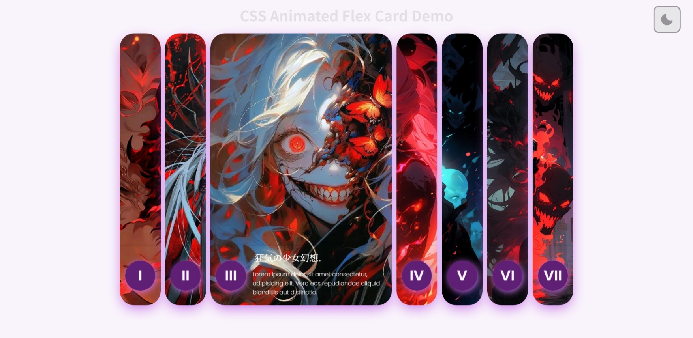

# 🔥 CSS Animated Flex Card Demo

A **responsive card animation showcase** built with **HTML, CSS, and JavaScript**, featuring
interactive flex cards, theme switching (Dark / Light mode), and Japanese-inspired design.

> 🎴 A personal project that explores CSS transitions, flex layouts, and clean UI animation logic.

---

## 🌐 Live Demo

[👉 View on GitHub Pages](https://nsnet21.github.io/13-css-card-animation/)

---

## 🧩 Overview

This project demonstrates:

- Animated **flex cards** that expand/collapse smoothly on click
- **Dark / Light theme toggle** with localStorage support
- Beautiful **Japanese-style typography** using Noto Sans / Serif JP
- Responsive scaling using CSS (`clamp`, `flex`, `backdrop-filter`)
- No external JS frameworks — only pure front-end logic (vanilla.js)

---

## 🧰 Built With

| Stack                        | Usage                                             |
| :--------------------------- | :------------------------------------------------ |
| **HTML5**                    | Base structure & semantics                        |
| **CSS3**                     | Layout, animations, transitions, and theme system |
| **Vanilla JavaScript (ES6)** | Card activation & theme switching                 |
| **Boxicons CDN**             | For theme toggle icons                            |
| **Google Fonts**             | Poppins, Noto Sans JP, Noto Serif JP              |

---

## 📸 Preview




---

## ⚙️ Project Structure

```
13CSS-Card-Animation/
│
├── asset-preview/
│ ├── preview.jpeg
│ └── ligt-preview.jpeg
│
├── images/
│ ├── 火の少年.jpg
│ ├── 呪われた少女.jpg
│ ├── 狂気の少女幻想.jpg
│ ├── 火の少女戦士.jpg
│ ├── 鬼の男子.jpg
│ ├── 魔性の女.jpg
│ └── ドクロ爆弾の少女.jpg
│
├── index.html
├── style.css
└── script.js
```

---

## 🎨 Features Breakdown

- 🌀 **Card Interaction** — click to expand and collapse individual cards
- 🌗 **Theme Switcher** — toggle between light/dark modes with smooth transition
- 🈶 **Typography** — inspired by _Japanese modern fantasy aesthetics_
- ⚡ **Responsive Design** — mobile-friendly with fluid scaling and adaptive font sizes
- 💾 **LocalStorage Sync** — remembers last theme choice automatically

---

## 🧠 Learning Focus

- CSS transitions & animation logic
- JS DOM manipulation (`addEventListener`, `classList`, `localStorage`)
- Responsive layout with `clamp()`, `flex`, and `media queries`
- UI polish: hover states, backdrop-filter, and subtle lighting effects

---

## 📌 Credits

- **Developer:** Nate (nsnet21)
- **Icons:** [Boxicons](https://boxicons.com/)
- **Fonts:** [Google Fonts](https://fonts.google.com/) — _Poppins, Noto Sans JP, Noto Serif JP_
- **Images:** Generated / curated for demo purpose only

---

## 📜 License

This project is open-source under the **MIT License** — feel free to learn, remix, and adapt.

---

### 🌸 “Designed with a spark of Japanese warmth and elegance.”
