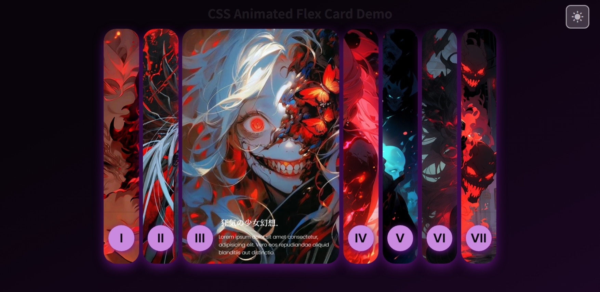

# 🔥 CSS Animated Flex Card Demo

A **responsive card animation showcase** built with **HTML, CSS, and JavaScript**, featuring
interactive flex cards, theme switching (Dark / Light mode), and Japanese-inspired design.

> 🎴 A personal project that explores CSS transitions, flex layouts, and clean UI animation logic.

---

## 🌐 Live Demo
[👉 View on GitHub Pages](https://nsnet21.github.io/13-css-card-animation/)

---

## 🧩 Overview
This project demonstrates:
- Animated **flex cards** that expand/collapse smoothly on click
- **Dark / Light theme toggle** with localStorage support
- Beautiful **Japanese-style typography** using Noto Sans / Serif JP
- Responsive scaling using CSS (`clamp`, `flex`, `backdrop-filter`)
- No external JS frameworks — only pure front-end logic (vanilla.js)

---

## 🧰 Built With
| Stack | Usage |
|:------|:------|
| **HTML5** | Base structure & semantics |
| **CSS3** | Layout, animations, transitions, and theme system |
| **Vanilla JavaScript (ES6)** | Card activation & theme switching |
| **Boxicons CDN** | For theme toggle icons |
| **Google Fonts** | Poppins, Noto Sans JP, Noto Serif JP |

---

## 📸 Preview
> (You can replace this with your screenshot or GIF preview)

---

## ⚙️ Project Structure
